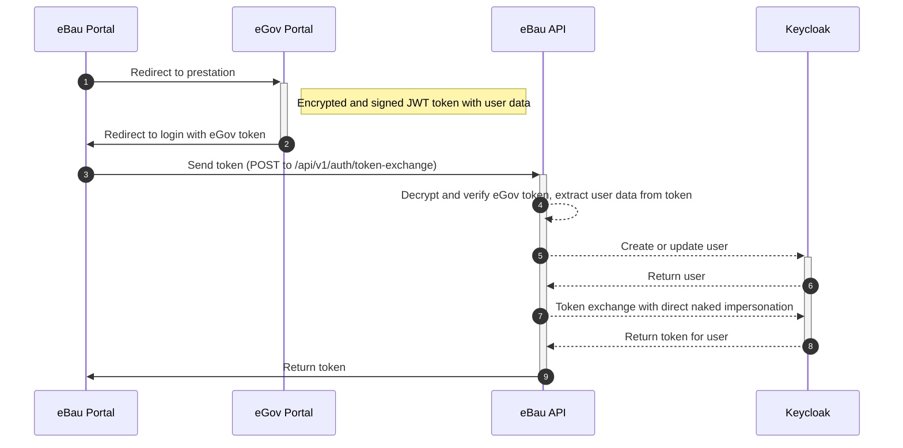

Electronic building permit application for Swiss cantons.

## Table of Contents

<!-- vim-markdown-toc GFM -->

- [Overview](#overview)
  - [Folder structure](#folder-structure)
  - [Available modules](#available-modules)
- [Requirements](#requirements)
- [Development](#development)
  - [Basic setup](#basic-setup)
  - [Predefined credentials](#predefined-credentials)
  - [Debugging](#debugging)
  - [Working locally with ember](#working-locally-with-ember)
    - [Help, ember-cli is not rebuilding after changes!](#help-ember-cli-is-not-rebuilding-after-changes)
    - [pnpm workspaces](#pnpm-workspaces)
  - [Django profiling](#django-profiling)
  - [Switching tenant](#switching-tenant)
    - [Working locally with ember](#working-locally-with-ember-1)
    - [Working with docker only](#working-with-docker-only)
  - [Visual Studio Code](#visual-studio-code)
  - [GraphQL](#graphql)
  - [GWR API](#gwr-api)
  - [Customize API](#customize-api)
  - [Sending email](#sending-email)
- [Module and canton specifics](#module-and-canton-specifics)
  - [Modules](#modules)
    - [Construction monitoring](#construction-monitoring)
      - [General](#general)
      - [Technical aspects](#technical-aspects)
  - [Custom authorization (Kt. SO)](#custom-authorization-kt-so)
- [License](#license)

<!-- vim-markdown-toc -->

## Overview

This repository contains the source code for the web applications used to handle electronic building permits and comparable processes in the Swiss cantons of Berne, Grisons, Schwyz, Solothurn and Uri.

The following image shows a high-level overview of the architecture:


- The application is composed of various Docker containers, which are shown in light blue in the architecture overview.
- The frontend consists of two Ember.js apps, one for applicants submitting building permit applications ("portal"), and another used by members of the public authorities ("internal area"). The two apps can share code through the Ember Addon `ember-ebau-core`.
- The backend is based on Python/Django and exposes a GraphQL API for forms and workflows based on [Caluma](https://caluma.io) and set of domain-specific REST endpoints ([Django REST Framework](https://www.django-rest-framework.org/)).
- PostgreSQL is used as database.

### Folder structure

```
├── compose                # docker-compose files
├── db                     # database Dockerfile and utils
├── django                 # backend code, containing both API and Caluma
├── document-merge-service # document generation templates and config
├── ember-caluma-portal    # Caluma-based portal
├── ember-camac-ng         # Ember.js app optimized for embedding in other applications
├── ember-ebau             # Ember.js based application for internal area
├── ember-ebau-core        # Ember.js addon for code sharing between multiple Ember.js apps
├── keycloak               # Keycloak configuration for local development
├── proxy                  # Nginx configuration for local development
└── tools                  # miscellaneous utilities
```

### Available modules

Due to ongoing modernization work, some Frontend modules are not yet integrated in `ember-ebau`, but instead are still part of `ember-camac-ng`. Few Frontend modules are not part of this repository yet at all. The following table lists the most important modules in the "internal" part of the application and their respective completeness / integration state (in the `demo` configuration).

| Module                       | Description                              | Backend            | Frontend                 | Part of ember-ebau       |
| ---------------------------- | ---------------------------------------- | ------------------ | ------------------------ | ------------------------ |
| _Main Nav (resource)_        |                                          |                    |                          |                          |
| Dossier list                 | Show a list of dossiers                  | :heavy_check_mark: | :heavy_check_mark:       | :heavy_check_mark:       |
| Task list                    | Show a list of tasks                     | :heavy_check_mark: | :heavy_check_mark:       | :heavy_check_mark:       |
| Templates                    | Manage document templates (docx)         | :heavy_check_mark: | :heavy_check_mark:       | :heavy_check_mark:       |
| Organization / Permissions   | Manage own organization and permissions  | :heavy_check_mark: | :heavy_check_mark:       | :heavy_check_mark:       |
| Static content               | Static content, markdown editor          | :heavy_check_mark: | :heavy_check_mark:       | :heavy_check_mark:       |
| Text components              | Manage snippets for usage in text fields | :heavy_check_mark: | :hourglass_flowing_sand: | :hourglass_flowing_sand: |
| _Subnav (instance resource)_ |                                          |                    |                          |                          |
| Tasks                        | View and manage tasks                    | :heavy_check_mark: | :heavy_check_mark:       | :heavy_check_mark:       |
| Form                         | View and edit main form                  | :heavy_check_mark: | :heavy_check_mark:       | :heavy_check_mark:       |
| Distribution                 | Get feedback from other organizations    | :heavy_check_mark: | :heavy_check_mark:       | :heavy_check_mark:       |
| Alexandria                   | Document management                      | :heavy_check_mark: | :heavy_check_mark:       | :heavy_check_mark:       |
| Template                     | Generate document from template          | :heavy_check_mark: | :heavy_check_mark:       | :heavy_check_mark:       |
| Journal                      | Collaborative notebook                   | :heavy_check_mark: | :heavy_check_mark:       | :heavy_check_mark:       |
| History                      | Shows milestones and historical data     | :heavy_check_mark: | :heavy_check_mark:       | :heavy_check_mark:       |
| Publication                  | Manage publication in newspaper          | :heavy_check_mark: | :heavy_check_mark:       | :heavy_check_mark:       |
| Objections                   | Manage objections                        | :heavy_check_mark: | :heavy_check_mark:       | :heavy_check_mark:       |
| Responsible                  | Assign responsible users                 | :heavy_check_mark: | :heavy_check_mark:       | :heavy_check_mark:       |
| Claims                       | Ask applicant for additional info        | :heavy_check_mark: | :heavy_check_mark:       | :heavy_check_mark:       |
| Rejection                    | Reject instance                          | :heavy_check_mark: | :heavy_check_mark:       | :heavy_check_mark:       |
| Billing                      | Manage billing entries                   | :heavy_check_mark: | :heavy_check_mark:       | :heavy_check_mark:       |
| Audit                        | Perform structured audit                 | :heavy_check_mark: | :heavy_check_mark:       | :hourglass_flowing_sand: |
| Audit-Log                    | Shows form changes                       | :heavy_check_mark: | :hourglass_flowing_sand: | :hourglass_flowing_sand: |

## Requirements

The preferred development environment is based on Docker.

- Docker >= 20.04
- Docker-Compose

For local development:

Python:

- python 3.8
- pyenv/virtualenv

Ember:

- current LTS of Node.js
- pnpm

## Development

### Basic setup

Docker can be used to get eBau up and running quickly. The following script guides you through the setup process. We recommend using the `kt_gr` or `kt_so` config for now, since other cantons still rely on legacy components for the internal area that are not part of this repository.

```bash
make start-dev-env
```

In case you want to manually modify /etc/hosts following domains need to point to
127.0.0.1 (localhost):

```
ebau-portal.local ebau.local ebau-keycloak.local ember-ebau.local ebau-rest-portal.local
```

For automatic checks during commit (formatting, linting) you can setup a git hook with the following commands:

```bash
pip install pre-commit
pre-commit install
```

After, you should be able to use to the following services:

- [ember-ebau.local](http://ember-ebau.local) - new main application used for "internal" users
- [ebau-portal.local](http://ebau-portal.local) - public-facing portal (Caluma-based, default choice for new projects, used in Kt. BE, UR)
- [ebau.local/django/admin/](http://ebau.local/django/admin/) - Django admin interface
- [ebau-keycloak.local/auth](http://ebau-keycloak.local/auth/) - IAM solution
- [ember-ebau.local/mailhog/](http://ember-ebau.local/mailhog/) - Mailhog UI
- [ember-ebau.local/minio/ui/](http://ember-ebau.local/minio/ui/) - MinIO Admin UI

### Predefined credentials

The following administrator accounts are present in Keycloak or the DB,
respectively:

| _Application_ | _Role_      | _Username_        | _Password_ | _Notes_ |
| ------------- | ----------- | ----------------- | ---------- | ------- |
| demo          | Admin       | user              | user       |         |
| kt_schwyz     | Admin       | admin             | admin      |         |
|               | Publikation | adsy              | adsy       |         |
| kt_uri        | Admin       | admin             | admin      |         |
|               | PortalUser  | portal            | portal     |         |
| kt_bern       | Admin       | user              | user       |         |
| kt_gr         | Admin       | admin@example.com | admin      |         |
| kt_so         | Admin       | admin             | admin      |         |

### Debugging

For debugging inside container shell, use this:

```bash
make debug-django
```

### Working locally with ember

```bash
docker-compose up -d --build db django
cd {ember|ember-camac-ng|ember-caluma-portal|ember-ebau} # Enter ember from the top level of the repo
pnpm install # Install dependencies
pnpm test # Run tests
pnpm start-proxy # Run dev server with proxy to django api
```

#### Help, ember-cli is not rebuilding after changes!

Since this is a large project with lots of files, the default setup of ember
will possibly fail to rebuild properly as it can't watch all of those files.

In order to fix that, [install watchman](https://facebook.github.io/watchman/docs/install) as file watcher and
adjust the `inotify` settings:

```bash
echo fs.inotify.max_user_watches=1000000 | sudo tee -a /etc/sysctl.conf # adjust settings
sudo sysctl -p # re-read config
```

Make sure that the latter command only returns one value, otherwise the settings
is duplicated and needs to be cleaned up.

#### pnpm workspaces

Note however that the apps `ember-caluma-portal`, `ember-camac-ng`, `ember-ebau` and the addon `ember-ebau-core` share the same node modules tree through a [pnpm workspace](https://pnpm.io/workspaces).

The common pnpm workspace allows us to share code (e.g. addons) between the apps which are part of this repo (instead of following the typical approach of publishing releases on npm). This also means that

- (+) we save some disk space because of the avoided duplication in the `node_modules` directory
- (-) the docker build processes of the two frontend containers have to run in the context of the root of the repo, in order to access the shared dependencies during build time
- (-) the ember versions `ember-caluma-portal` and `ember-camac-ng` need to be kept in sync

### Django profiling

To enable `django-silk` for profiling, simply add `DJANGO_ENABLE_SILK=True`
to your `django/.env` file. Then restart the django container and browse to
http://ebau.local/api/silk/.

### Switching tenant

To switch from the `demo` config to `kt_bern`, one has to make sure that the frontend apps take up the right
environment variables.

#### Working locally with ember

1. Stop the frontend servers started with `pnpm start-proxy`
2. Run `make kt_bern`
3. Run `docker-compose up -d && make loadconfig`
4. Start using command from step 1

#### Working with docker only

1. Run `docker-compose down`
2. Run `make kt_bern`
3. Run `docker-compose build`
4. Run `docker-compose up -d`

### Visual Studio Code

The remote debugger settings for VS Code are committed to the repository.

- The configuration file is located at `.vscode/launch.json`.
- The keyboard shortcut to launch the debugger is <kbd>F5</kbd>.
- [Information on VS Code debugging](https://code.visualstudio.com/docs/editor/debugging)

To enable debugging in the django container the ptvsd server must be started.
Since this debug server collides with other setups (PyCharm, PyDev) it will
only be started if the env var `ENABLE_PTVSD_DEBUGGER` is set to `True` in
[`django/.env`](django/.env).

### GraphQL

In order to talk to the `/graphql` endpoint with authentication, you can install
a GraphQL Tool (much like Postman). Tools you might consider here:

- [Insomnia](https://insomnia.rest/download)
- [Altair GraphQL client](https://altairgraphql.dev/#download)

### GWR API

The GWR module is developed in two separate repositories:

- Frontend: [inosca/ember-ebau-gwr](https://github.com/inosca/ember-ebau-gwr)
- Backend: [inosca/ebau-gwr](https://github.com/inosca/ebau-gwr)

If you use the GWR module, you need to generate a Fernet key
according to the [documentation](https://github.com/inosca/ebau-gwr) of the gwr backend.

You need to set this key in each environment/server in your env file.
**Generate a separate key for each environment, since this is used to store /
read the gwr user passwords.**

### Customize API

The API should be designed in a way, that allows it to be used by any eBau project. For needed
customization, the following rules apply:

- each permission may be mapped to a specific role in the specific project.
  In case a role may have different set of permissions than already available,
  introduce a new one and adjust the different views accordingly.
- for features which may not be covered by permissions, introduce feature flags.

For different feature flags and permissions, see `APPLICATIONS` in settings.py.

### Sending email

In development mode, the application is configured to send all email to a
Mailhog instance, so unless you specify something else, no email will be
sent out from the development environment.

You can access the Mailhog via <http://ebau.local/mailhog/> . Any email sent out
will be instantly visible there.

## Module and canton specifics

Section to collect information on modules and cantons.
This section is intended to facilitate know-how transfer, vacation handovers and debugging support cases.

### Modules

#### Construction monitoring

##### General

Module used in Kt. SZ and Kt. UR (soon-ish), which accompanies the construction process after the decision.
The municipality (up to now only cases are covered where the lead authority is the municipality) and the applicant interact through a series of work-items with documents.

There are construction stages ("Bauetappen"), which consist of dynamically selectable construction steps.
Construction steps are a series of work-items, which usually follow the pattern of starting with a work-item addressed to the applicant, followed by one or more work-items addressed to the municipality. The applicant confirms, that they have adhered to the defined regulations, and the muncipality verifies it. The final work-item allows the muncipality to decide whether to continue the process or re-iterate to the beginning of the construction step.

##### Technical aspects

The module is heavily defined by the configured workflow. Which construction steps and therefore which work-items are performed is handled through dynamic tasks. Construction step configuration (such as which task belongs to which construction step) is configured in the meta of tasks belonging to a construction step.
Construction steps are essentially a grouping of tasks, there is no model representing them.

Construction stages are a multiple instance work-item with a child-case. The child-case contains the construction step work-items.
The first construction stage is created when initializing the construction monitoring process.
After that, a new construction stage can be initialized by a create work-item mutation on the existing work-item (in the status ready).
BEWARE: To ensure that a new construction stage can always be created as long as the construction monitoring process isn't completed, the construction stage work items remain ready, while the construction stage child case has already been completed.

The core logic is contained mainly in the construction monitoring workflow and form configuration of the canton, the caluma events for the construction monitoring, module settings, some custom visibility and permission logic.

### Custom authorization (Kt. SO)

In the canton of Solothurn we use a custom authorization mechanism for the eBau
Portal. The eBau portal can only be used with a login from my.so.ch, their eGov
portal software. Since they do not offer OIDC authorization, we had to implement
a custom solution using Keycloak's token exchange and direct naked impersonation
features.

The authorization is designed to retreive an encrypted and signed JWT token
which is then converted to a regular OIDC JWT token by Keycloak:



To enable the feature, the following configuration must be done:

By default Keycloak is already properly configured to support this authorization
mechanism. In order to configure another environment, please refer to [the
documentation](django/camac/token_exchange/docs/keycloak.md)

```ini
# .env
ENABLE_TOKEN_EXCHANGE=true
```

This will enable the feature with a dummy eGov portal hosted on our NGINX proxy.
In order to test with the eGov portal test environment we need to set some more
environment variables (the censored values can be found in Vault):

```ini
# .env
EGOV_PORTAL_URL=****
EGOV_PRESTATION_PATH=****
```

```ini
# django/.env
TOKEN_EXCHANGE_JWT_ISSUER=****
TOKEN_EXCHANGE_JWT_SECRET=****
TOKEN_EXCHANGE_JWE_SECRET=****
```

## License

This project is licensed under the EUPL-1.2-or-later. See [LICENSE](./LICENSE) for details.
