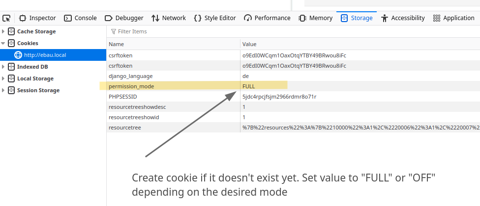

# INOSCA permissions module - integration and testing

The integration of the permissions module requires a few steps to complete.
With "older" cantons, some additional consideration and in-depth understanding
of all the processes is required to ensure the integration is correct and
complete.

This guide aims at helping with the integration - the full testing work
needs to be done from the perspective of the user, and needs to be guided
by someone who is familiar with the application.

Generally, the integration of a canton will require the following steps:

1. Define the required access levels and their permissions
2. Implement event handlers to grant and revoke ACLs as needed
3. Run the migration to generate the ACLs from the data already in the system
4. Test, test, test!


## Access level structure

Initial work needs to be done to set up the permissions structure. This implies
defining the required **access levels**.

An access level is the base entity, which defines the permissions a set[^1] of users
may have on a dossier. For each access level, a number of permissions are given,
each with a more or less complex set of conditions (see [configuration](./configuration.md)
for further details)

Generally, those access levels can be derived from the existing user roles, but
some simplification may be possible due to the way the access levels define the
applicable permissions.

Try to use the same access levels as are already used by other cantons. This
will keep the vocabulary small when working across cantons, and helps with
migration work as well.

[^1]: A "set" here means either a single user, a service, role or group, or even
the general public. We try to avoid using the term group, as it has a slightly
different meaning in the codebase already.

## Setting up the actual permissions

The permissions themselves are simple strings that denote an "atomic" view of
something that is either allowed or not. During integration of the first few
cantons, the following structure has been crystallized out.

* `$MODULE-read` - general access to a module
* `$MODULE-$VERB` - perform an action within said module
* `$MODULE-$VERB-$SUBJECT` - perform an action within said module,
  restricted to a given subject.

It is highly recommended to setup the `core.json` instance resources such
that all cantons share the exactly same `require_permisison` values for the same
CAMAC instance resources.

Re-using the same permissions across the application is paramount in avoiding
canton-specific code checks in the future: The code can then simply check if a
permission is given without needing to lookup the permission in the config.

It is recommended to define new permissions as constants where possible, and
use them. A good example on the structuring is the permissions module itself:

* `"permissions-grant-any"` - allows user to grant any permission (to anyone)
* `"permissions-revoke-any"` - allows user to revoke any ACL
* `"permissions-list-any"` - allows user to see all ACLs on the given instance.
* `"permissions-grant-$SLUG"` - allows user to grant a permission with the access
  level `$SLUG`
* `"permissions-revoke-$SLUG"` - allows user to revoke ACLs with access level `$SLUG`
* `"permissions-list-$SLUG"` - allows user to see ACLs on the given instance,
  if they have the access level `$SLUG`

Matching constants, or "constant functions" for these permissions are defined in
`camac.permissions.permissions`:

* `[GRANT|REVOKE|LIST]_ANY`
* `[GRANT|REVEOKE|LIST]_SPECIFIC(accesslevel_name)`

There is a management command that you can use to list all currently-defined
permissions, and the context (access levels) where they are used:

```
./manage.py list_permissions [--all-cantons]
PERMISSION                         ACCESS LEVEL
additional-demands-read          - distribution-service(so), involved-authority(bern), lead-authority(bern,so)
appeal-read                      - involved-authority(bern), lead-authority(bern,so)
applicant-add                    - applicant(bern,so)
...
```

### Permission conditions

Each permission within an access level may be decorated with a composable set of
checks. Those need to pass before a permission will be applicable.

Several of those are available in the `camac.permissions.conditions` module:

* `HasRole`: will check if user has a given role
* `RequireInstanceState`: only allows permission if instance is in a given state
* `HasInquiry`: Current user is involved in an inquiry ("Zirkulation")
* `IsAppeal`: Only applies if the current instance is an "appeal dossier"
* `Always`: will always grant the permission
* `Never`: will never grant the permission
* `IsForm`: The instance's main case's document has one of the given forms
* `Callback`: generic callback, if you need a client-specific check
* `HasApplicantRole`: will check if user has a given applicant role (admin, editor or readonly)
* `IsPaper`: only applies if the current instance is a "paper dossier"
* `RequireWorkItem`: Will check if the instance has a certain work item (the status of the work item doesn't matter)

These conditions are composable, by combining them with binary operators like
`&` (AND) as well as `|` (OR) and even prefix operator `~` (NOT). It is entirely
possible to construct complex checks like these:

```python
STATES_POST_DECISION = RequireInstanceState(
    ["decided", "construction-monitoring", "finished", "withdrawn"]
)
FORMS_ONLY_BUILDING_PERMIT = ~IsForm(["voranfrage", "meldung"])
MODULE_CONSTRUCTION_MONITORING = (
    STATES_POST_DECISION
    & FORMS_ONLY_BUILDING_PERMIT
    & HasRole(["municipality-construction-monitoring"])
    & ~IsAppeal()
)

[...]

{
    "ACCESS_LEVELS": {
        ...
        "lead-authority": [
            ...,
            ("construction-monitoring-read", MODULE_CONSTRUCTION_MONITORING),
            ...
        ],
        ...
    }
}
```

### Module-specific permission rules

There are some modules where we decided that the rules are too complex and
no further work is done to map these existing rules to the new permissions system.
One of those examples is the (old) *documents module*. Here, the permissions
module stops at the instance-resource visiblity, and any further access rules
regarding upload, read, move permissions depending on category is delegated
to those module-specific rules.

### Mapping InstanceResource permissions with tool assistance

There is a commandline tool, `./manage.py validate_instance_permissions`

You will need to define some mappings from roles to accesslevels in the
management command (search for `ROLE_TO_ACCESSLEVEL`).

This tool will output suggested permissions settings to reflect the currently
defined old-CAMAC style InstanceResourceACLs.

Note that this process is not 100% accurate due to custom code that may grant
additional access, or hide instance resources. But it is a good starting point
and gets you a good way ahead.

### Permissions setup summary

So, in summary: For simple module access, check existing canton configuration
to ensure the same permission strings are being used. BE and SO are good
candidates.

It is important to keep the permission strings the same across the cantons to
avoid complicated config lookups in the future.

Also try to use the same access levels as other cantons, as far as possible.
It will help with the migration, as more code and mappings can be reused.

Note: Do not try to 1:1 match the old config. Instead, try to configure what
makes sense and discuss it with the customer.

## Permission events

The old permissions system used state-based checks all over the place. For example,
the `@permission_aware` decorator could call different methods depending on the
user's current group, or better, it's associated role. The visibility and
further permission details depended on an instance's state and further data
structures such as work items with a given task, and so on.

The new permissions system instead does away with all this: You either have
access to an instance, or you don't (Permissions within an instance still
depend on certain conditions, but those can be checked in a rather short time).

This implies granting access when a certain event occurs, instead of checking
the possibly complex system state when access to a feature requested.
For this, you need to define a canton-specific permission event handler:

* Create a corresponding class in `camac.permissions.config.$CANTON.py`
* Reference it in the `EVENT_HANDLER` setting in the permissions module
  settings (TODO: where exactly?)
* Either use some of the provided mixins, or implement the relevant methods
  yourself, if the mixin does not do exactly what you need.
  The `camac.permissions.config.common` module contains:

  - `ApplicantsEventHandlerMixin` - Creates an "applicant" ACL for every
    applicant that is created (or when they log in after being invited)
  - `InstanceSubmissionHandlerMixin` - Grants the "lead-authority" ACL
    to the service of the responsible municipality
  - `ChangeResponsibleServiceHandlerMixin` - Revoke "lead-authority",
    grant new "lead-authority" and "involved-lead-authority" as well as
    construction control ACLs when the responsible service is changed
  - `DistributionHandlerMixin` - Grant the "distribution-service" ACL to a service
    that is freshly invited in an inquiry work item
  - `GrantSupportOnCreationHandlerMixin`
    The support role is granted "support" permissions on every newly created
    instance.

## Migrate the system state

Because the new permissions module does not look at the *current state* anymore,
there needs to be a migration that transfers this system state into a set of
ACLs.

For this, there is a management command:

`./manage.py migrate_permissions`

This command will require some minimal configuration, and might, possibly, be
incomplete. Some intensive testing will be required after the migration ran, to
ensure that the application state is correctly translated to the new ACLs.

## Testing

Once the migration is done (either partially or for a few select instances),
you can start testing by changing the permission module's operating mode:

Change the permissions module settings for your canton (normally under
`django/camac/settings/modules/permissions/$CANTON.py`) by modifying the
`PERMISSION_MODE` setting from `PERMISSION_MODE.OFF` to `PERMISSION_MODE.FULL`.

Here are the settings you can use for the `PERMISSION_MODE`:

* `FULL`: Full on = old permission code is not used anymore
* `CHECKING`: Checking runs both old and new code, raises an exception on difference.
  Note: This is rather slow outside small dev/test datasets and should not be used
  permanently
* `LOGGING`: Logging mode is equal to checking, but only a warning is logged instead of
  raising an exception. Returns "old" data if it differs.
  Note: This is rather slow outside small dev/test datasets and should not be used
  permanently.
* `OFF`: Off mode means only the old permission code is run

There are a few more modes that are not recommended, as the performance impact is
too big, and automatically changes behaviour depending on environment:

* `CLEANUP_AFTER_MIGRATION`: Cleanup mode is used as a marker to find all call
  sites and remove the old code (as well as the switcher) once we are done
  with the migration
* `AUTO_ON`: Auto on mode uses "checking" mode in dev env, but logging mode in production
* `AUTO_OFF`: Auto off mode uses logging mode in dev, but "off" in production.
* `DEV`: Equal to logging, but returns "new" data if it differs


### Recommendation: Testing in dual mode

You can set a cookie named `permission_mode` to override the configured mode.
This allows you to use the following workflow:

1. Open two different browsers (or one in private mode, or similarly separated)
2. Login to eBau with the same user in both
3. In one, set the cookie `permission_mode` to `OFF`, in the other one set it to `ON`
4. Click through the application side-by-side and compare the behaviour



## Caveats & Gotchas

* Paper instances behave rather differently and may require specific rules. Make
  sure to test them properly!
* Caching in the permission module is used to avoid recalculating if not neccessary.
  When you're changing the permission structure (adding/removing permissions from access
  levels, changing the conditions, etc) the "visible" permissions may remain unchanged
  due to caching. Be sure to disable it when working on permissions config!
* If you need a new condition, try to quantize the number of use-cases for
  it before writing a new condition class. If it's not a common use case, use
  `Callback` instead
* Don't hide modules for access-levels in instance states where the access-level
  cannot be involved yet (e.g. don't hide the audit module for distribution
  services in status "subm"). This can simplify the configuration significantly
