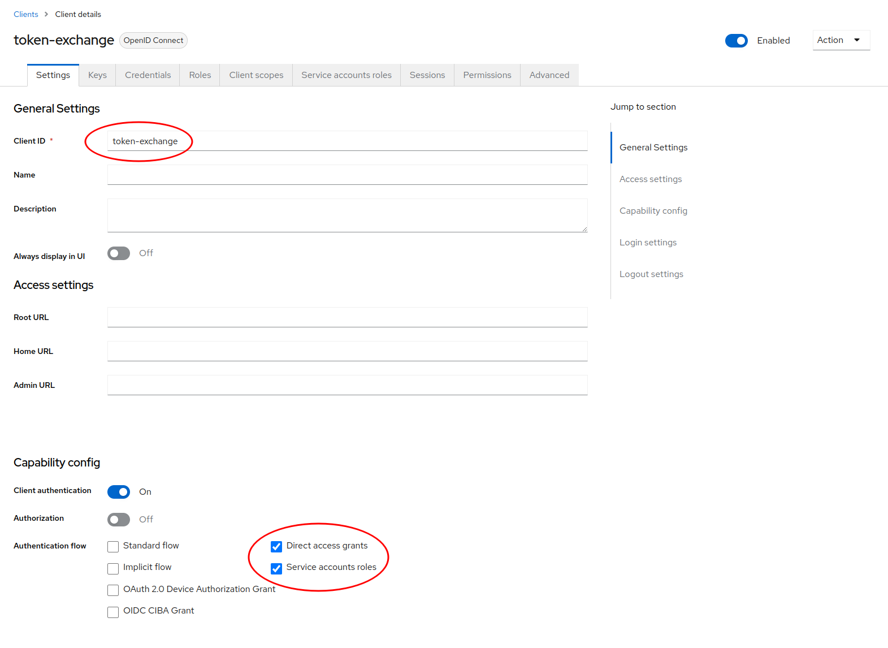
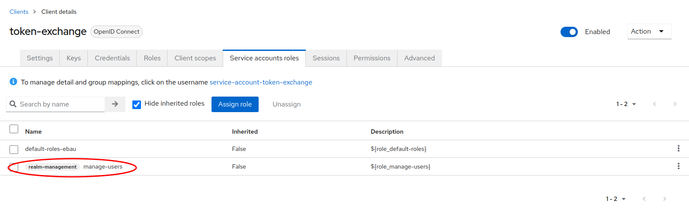
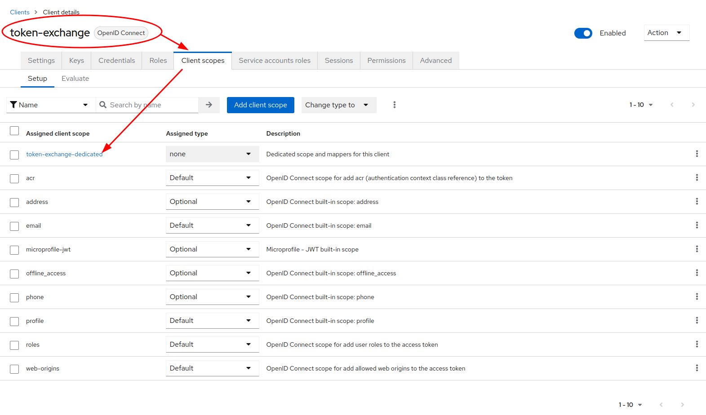
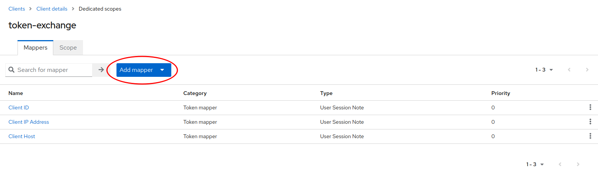
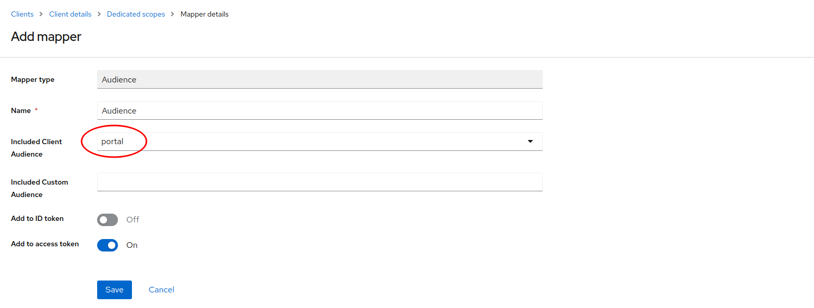
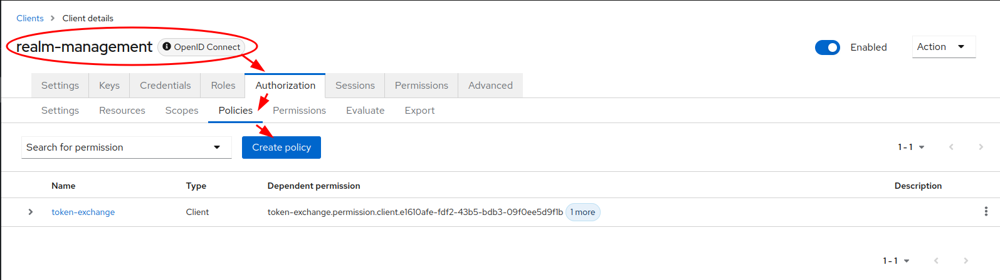
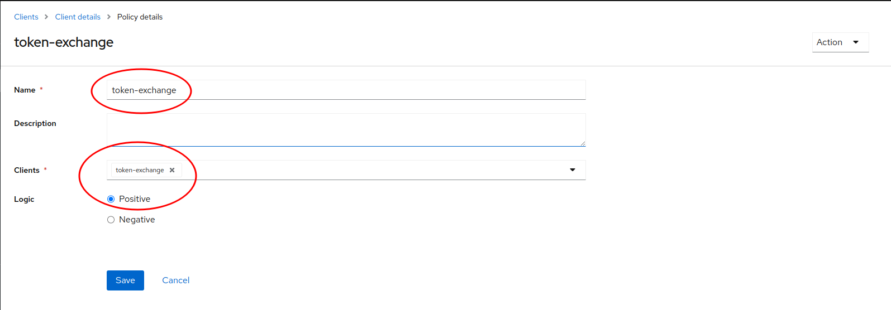
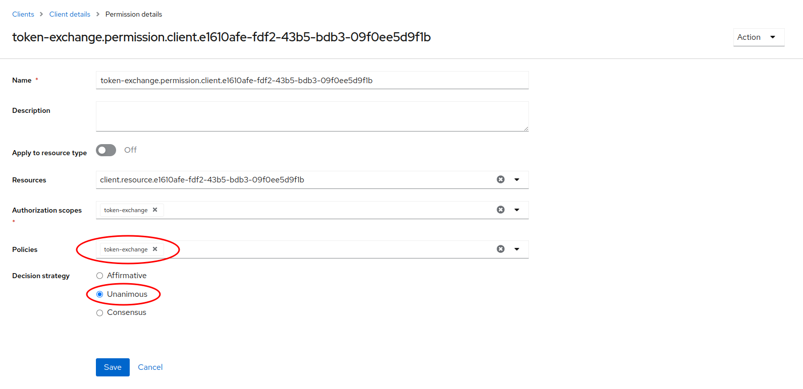
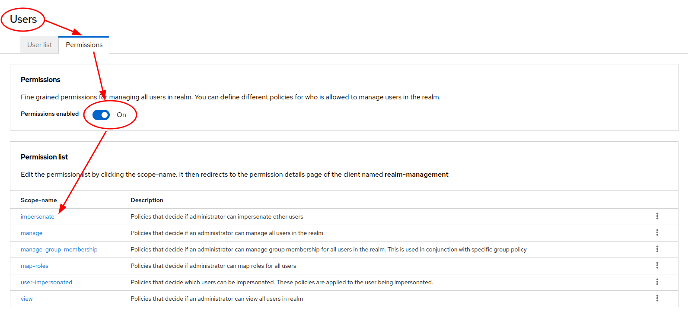
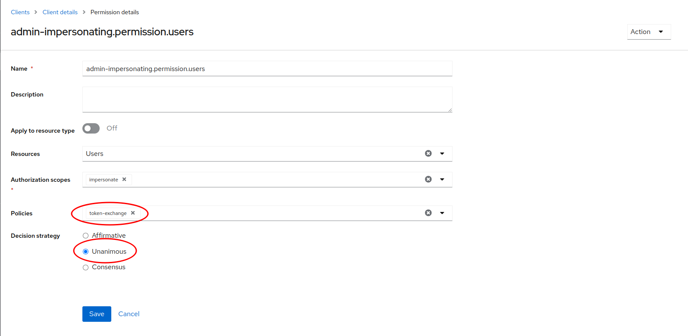

# Keycloak configuration

## 1. Create new client "token-exchange"

## 2. Grant service account role "manage-users" to "token-exchange" client

## 3. Create client scope mapper "Audience" for "token-exchange" client

This is only needed because Keycloak doesn't support passing a specific audience
for the requested token exchange: https://github.com/keycloak/keycloak/issues/17668

## 4. Create new positive client policy "token-exchange"

## 5. Grant permissions for token exchange on "portal" client and assign policy "token-exchange"

## 6. Grant permissions for impersonate on user permission tab and assign policy "token-exchange"

