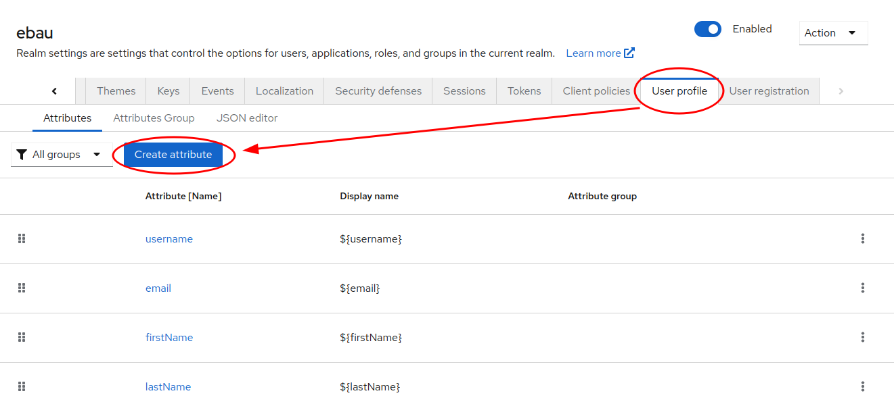
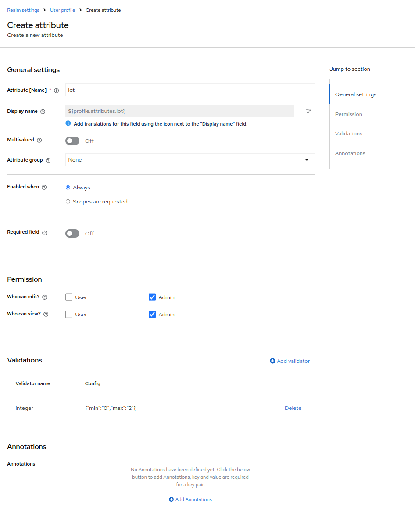
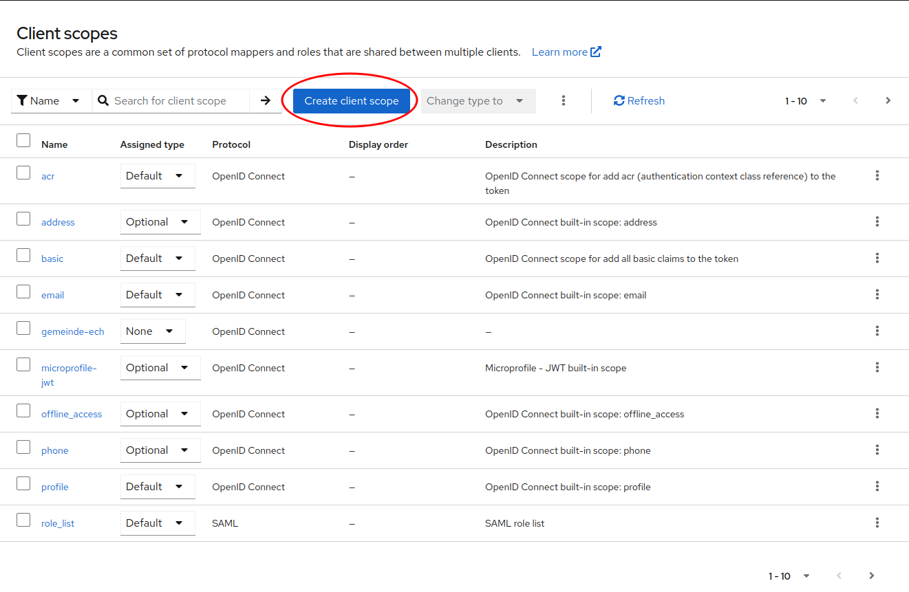
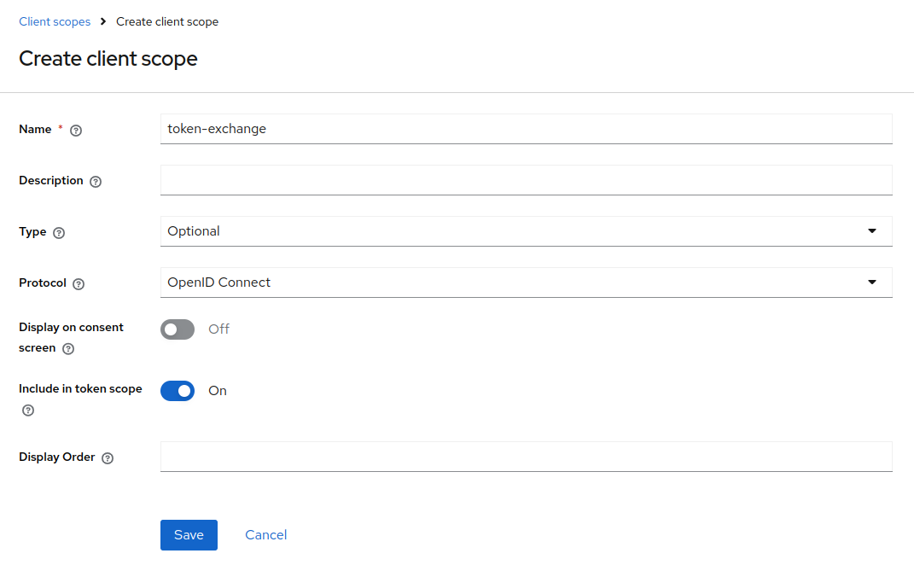
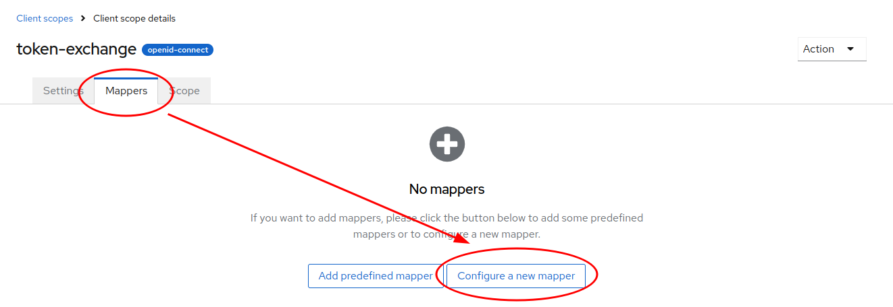
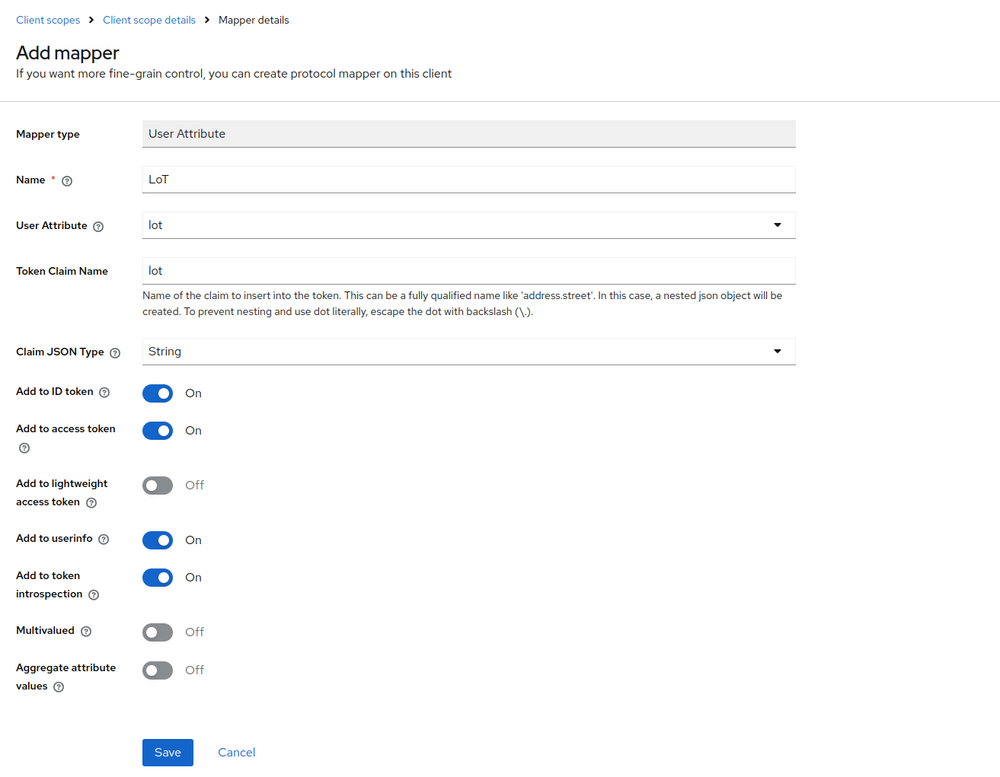
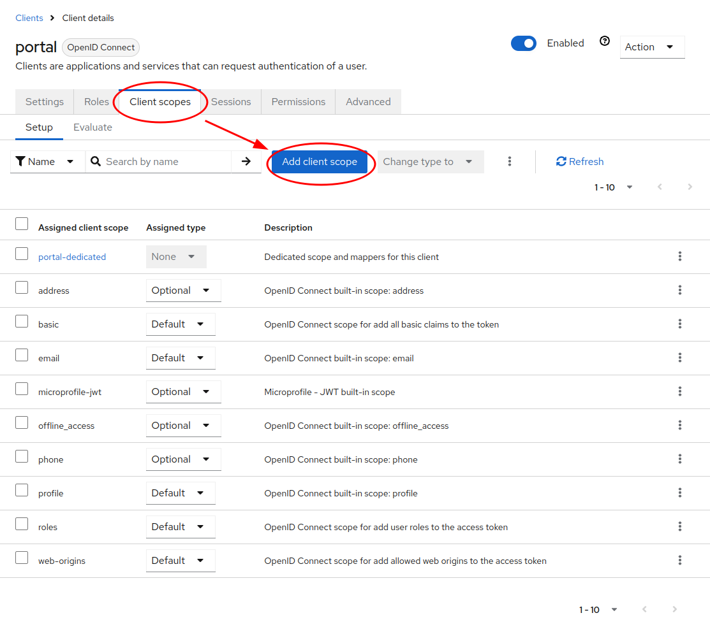
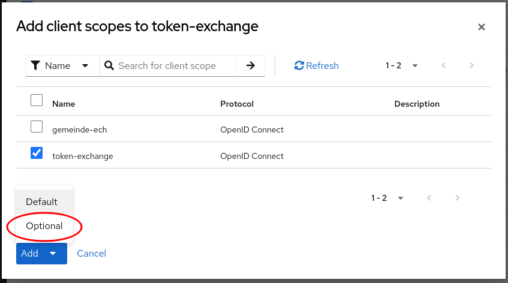

# Keycloak configuration

## 1. Create new client "token-exchange"

## 2. Grant service account role "manage-users" to "token-exchange" client

## 3. Create new positive client policy "token-exchange"

## 4. Grant permissions for token exchange on "portal" client and assign policy "token-exchange"

## 5. Grant permissions for impersonate on user permission tab and assign policy "token-exchange"

## 6. Create new user attribute "LoT"

## 7. Create new client scope "token-exchange"

## 8. Add new token mapper "LoT" to client scope "token-exchange"

## 9. Assign client scope "token-exchange" to client "portal"

